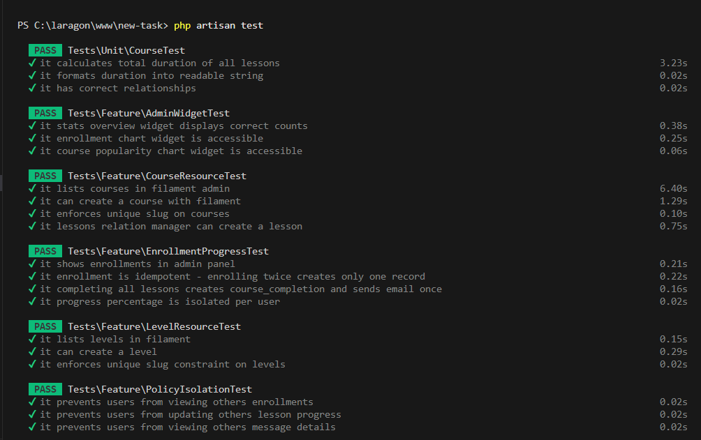
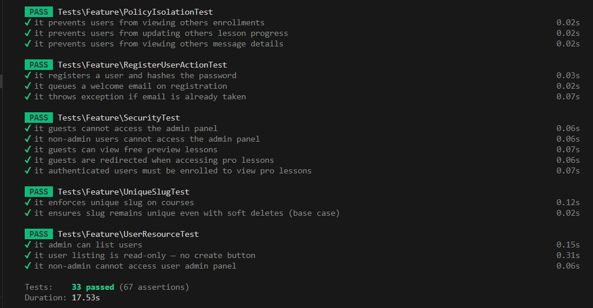
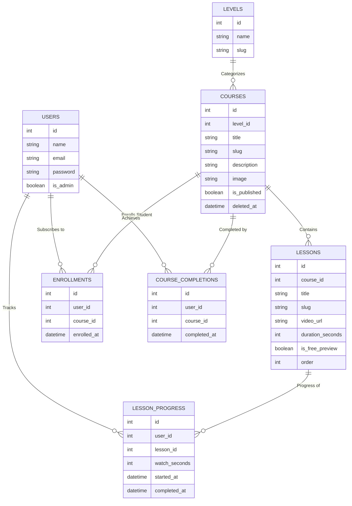

# Career 180 - Mini LMS Platform 🚀

A high-performance, secure Learning Management System (LMS) built with **Laravel 12**, **Livewire 3**, **Alpine.js**, and **Filament v3**. This platform features a sleek dark-themed frontend for students and a comprehensive analytics dashboard for administrators.

---

## 🌐 Live Demo

You can explore the live version of the project here:

*   **Student Portal:** [http://mini-lms-task.kesug.com/](http://mini-lms-task.kesug.com/)
*   **Admin Dashboard:** [http://mini-lms-task.kesug.com/admin](http://mini-lms-task.kesug.com/admin)

---

## 🔑 Demo Credentials

| Role  | Email           | Password |
|-------|-----------------|----------|
| **Admin** | `admin@gmail.com` | `password` |
| **Student** | `user@gmail.com`  | `password` |

---

## 🛠 Setup & Installation

Follow these steps to set up the project locally:

### 1. Requirements
*   PHP 8.2+
*   Composer
*   Node.js 18+ & npm
*   MySQL or SQLite

### 2. Installation
```bash
# Clone the repository
git clone <repository-url>
cd new-task

# Install dependencies
composer install
npm install
```

### 3. Environment & Database
```bash
# Setup environment file
cp .env.example .env
php artisan key:generate

# Configure your DB in .env then run:
php artisan migrate:fresh --seed
```

### 4. Assets & Storage
```bash
php artisan storage:link
npm run build
```

---

## 🧪 Automated Testing

The project is backed by a robust test suite (33 tests) using **Pest**, covering security policies, data isolation, and core business logic.

### Run Tests:
```bash
php artisan test
```

### Test Results Performance:



---

## 📊 Database Schema (ERD)



---

## ✨ Key Features

*   **🔒 High Security**: Data isolation via Laravel Policies ensuring users only access their own data.
*   **🏎️ Performance**: Debounced Livewire filtering and Alpine.js for instantaneous UI responses.
*   **🎥 Smart Video Player**: Interactive Plyr.js player that saves student progress in real-time.
*   **📊 Business Intelligence**: Admin dashboard with real-time statistics and enrollment charts.
*   **📦 Atomic Operations**: Transaction-safe enrollment and completion logic using Atomic Locks.
*   **📩 Automated Emails**: Queued welcome and completion emails with spam prevention.

---

## 📂 Project Structure Highlights

- **`app/Actions`**: Pure business logic (enrollment, registration, completion).
- **`app/Policies`**: Security layer for data isolation.
- **`app/Livewire`**: Interactive frontend components.
- **`resources/views/livewire`**: Modern Blade templates with Alpine.js integrations.

---

## 🚀 Future Roadmap (If I had more time)

While the current MVP meets all requirements, here are the professional improvements I would implement in a production scaling phase:

1.  **💳 Subscription & Payment Integration**: Monetize the platform by integrating **Laravel Cashier** (Stripe or Paddle) to handle monthly subscriptions, tiered pricing, and automated invoicing.
2.  **🔐 Enhanced Security**: Implement Two-Factor Authentication (2FA) for administrators and social login (OAuth) for students via **Laravel Socialite**.
3.  **� Production Dockerization**: Create a multi-stage production-ready `Dockerfile` and `docker-compose.yml` optimized for performance (OPcache, JIT) and security.
4.  **🎮 Gamification**: Implement a points and badges system using a polymorphic relationship to reward student consistency and engagement.

---

Developed for the **Career 180 Full-Stack Challenge**.