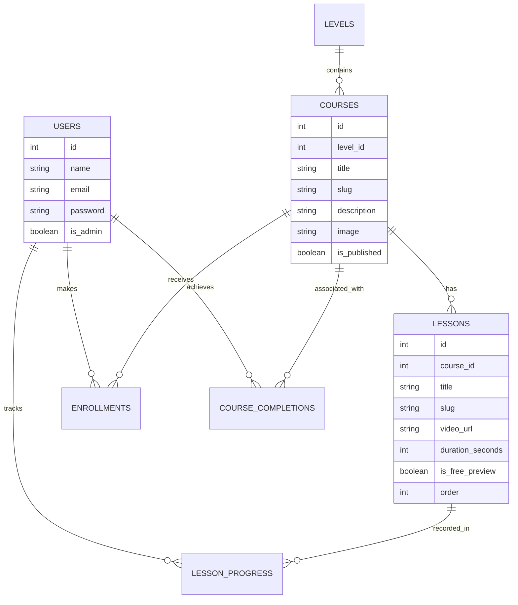

# Career 180 LMS

A Learning Management System (LMS) built with Laravel 12, Livewire 3, Alpine.js, and Filament v3. This project was developed as part of the Career 180 Full-Stack Challenge.

## Requirements

*   PHP 8.2+
*   Composer
*   Node.js 18+ & npm
*   MySQL or SQLite

## Setup Instructions

### 1. Installation
Clone the repository and install the dependencies:
```bash
composer install
npm install
```

### 2. Environment Configuration
Create your environment file and generate the application key:
```bash
cp .env.example .env
php artisan key:generate
```

### 3. Database Setup
Configure your database credentials in `.env`, then run the migrations and seed the initial data:
```bash
php artisan migrate:fresh --seed
```

### 4. Storage & Assets
Link the storage directory and build the frontend assets:
```bash
php artisan storage:link
npm run build
```

### 5. Running the Application
Start the development server:
```bash
composer run dev
```

The system uses asynchronous emails. To process them, start the queue worker:
```bash
php artisan queue:work
```

## Database Seeding

The seeder creates the following accounts:

| Role  | Email           | Password |
|-------|-----------------|----------|
| Admin | admin@gmail.com | password |
| User  | user@gmail.com  | password |

The seeder populates the database with:
*   3 Levels (Beginner, Intermediate, Advanced)
*   6 Primary courses with lessons and free previews.
*   50+ generated courses for pagination and UI testing.

## Testing

Run the test suite using Pest:
```bash
php artisan test
```

The project includes **30 automated tests** covering:
*   **Business Logic**: Registration, idempotent enrollment, and lesson completion.
*   **Security**: Access control policies, admin panel restrictions, and rate limiting.
*   **Admin**: Dashboard metrics, analytics charts, and resource CRUD.

## Technical Overview

### Database Schema


### Core Features
*   **Video Player**: Integration with Plyr.js for lesson playback with progress saving.
*   **Admin Dashboard**: Custom Filament views for managing courses, users, and tracking real-time progress.
*   **Action Architecture**: Business logic encapsulated in single-responsibility Action classes with transaction safety.
*   **UI/UX**: Responsive design with dark mode support, glassmorphism elements, and smooth interactions via Alpine.js.
*   **Transactional Integrity**: Atomic handling of course completion and enrollment to prevent data inconsistencies.

## Configuration Notes
*   **Mail**: Defaults to the `log` driver. Set `MAIL_MAILER=smtp` and provide credentials in `.env` for real delivery.
*   **Slugs**: Unique slug generation is handled at the database and application levels, ensuring consistency across soft deletes.